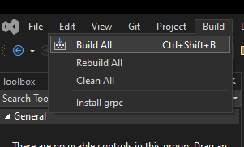
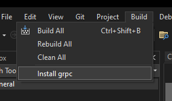
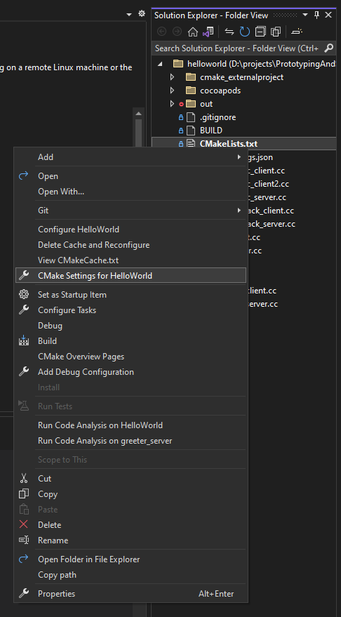
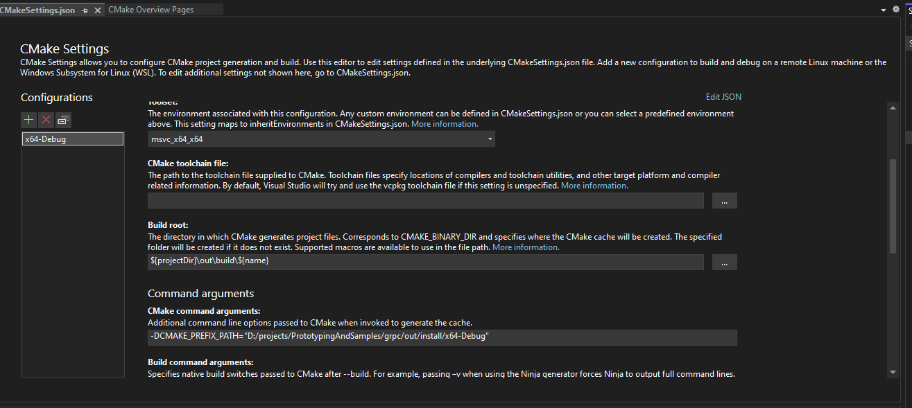

Download and isntall NASM from https://www.nasm.us/ for all users

if grpc folder not already there:
> git clone -b RELEASE_TAG_HERE https://github.com/grpc/grpc
> cd grpc
> git submodule update --init

Open Visual Studio and select open local folder:
open the grpc root folder which is also the cloned git root folder.

Let cmake configure the build. If cmake configuration is finished execute the build using visual studio :

Before grpc can be used in an example or similar we need to install grpc using visual studio:

Now the grpc solution can be closed.
We will need to copy the path, where grpc has been installed to. 
\<grpcroot\>\out\install\x64-Debug into the copy buffer

now open open Visual Studio and select open local folder:
open the \<grpcroot\>\examples\cpp\helloworld folder.

Now cmake will start and fail as it cannot find the grpc headers and libs.
Therefore we will need to edit the cmake config. We do this also in Visual Studio

Find the Cmake Command arguments option and add:
-DCMAKE_PREFIX_PATH="D:/projects/PrototypingAndSamples/grpc/out/install/x64-Debug"

paste and use your grpc install path from your copy buffer here. Make sure that you exchange the backslashes with frontslashes.

Press ctrl+s to save the configuration and retrigger the cmake configuration.
After cmake configuration has finished successfully, build the solution using visual studio:

Now the examples can be be debugged and executed.

